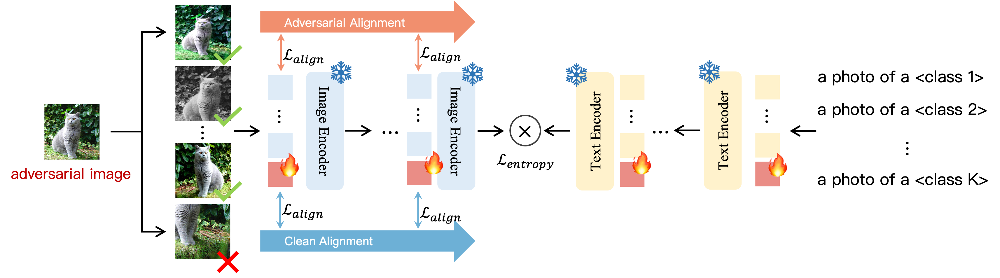

# TAPT: Test-Time Adversarial Prompt Tuning for Robust Inference in Vision-Language Models

Official PyTorch implementation of the following paper:

TAPT: Test-Time Adversarial Prompt Tuning for Robust Inference in Vision-Language Models, CVPR 2025.

<br>

<div style="text-align: center; margin-top: 0px;">
  <a href="https://openaccess.thecvf.com/content/CVPR2025/papers/Wang_TAPT_Test-Time_Adversarial_Prompt_Tuning_for_Robust_Inference_in_Vision-Language_CVPR_2025_paper.pdf" target="_blank" style="text-decoration: none; color: #007acc;">
    TAPT: Test-Time Adversarial Prompt Tuning for Robust Inference in Vision-Language Models,
  </a><br><br>
    
Xin Wang<sup>1</sup>, Kai Chen<sup>1</sup>, Jiaming Zhang<sup>2</sup>, Jingjing Chen<sup>1</sup>, Xingun Ma<sup>1</sup>
\
<sup>1</sup>Shanghai Key Lab of Intell. Info. Processing, School of CS, Fudan University \
<sup>2</sup>Hong Kong University of Science and Technology

<br>

<p align="center">

</p>

# Environment Setup

To set up the required environment, please follow the installation instructions provided in the [Train-Time APT repository](https://github.com/xinwong/Multimodal-Adversarial-Prompt-Tuning.git).

# Data Preparation

Before training or evaluating the models, you'll need to prepare the necessary datasets. Detailed instructions on downloading, preprocessing, and organizing the data can be found in [DATASETS.md](docs/DATASETS.md).

ADV_DIR can be generated using the [Train-Time APT repository](https://github.com/xinwong/Multimodal-Adversarial-Prompt-Tuning.git).


# Training and Evaluation

This project provides scripts for test-time tuning and evaluating various prompt designs. You can find all scripts in the `./scripts` directory.


## Example Usage

Here are examples of how to train and evaluate different Test-Time Adversarial Prompt Tuning using a ViT-B/16 backbone in a zero-shot setting:

*   **TAPT-VLI (Test-Time Adversarial V-L Independent Prompt):**

    ```bash
    ./scripts/vlip/TAPT_VLI_0shots_step1_eps1.sh
    ```

*   **TAPT-VLJ (Test-Time Adversarial V-L Joint Prompt):**

    ```bash
    ./scripts/vljp/TAPT_VLJ_0shots_step1_eps1.sh

# Acknowledgement

This repository is built upon [`PromptAlign`](https://github.com/jameelhassan/PromptAlign) and [`TPT`](https://github.com/azshue/TPT). Thanks for those well-organized codebases.

# Citation

```
@inproceedings{wang2025tapt,
  title={TAPT: Test-Time Adversarial Prompt Tuning for Robust Inference in Vision-Language Models},
  author={Wang, Xin and Chen, Kai and Zhang, Jiaming and Chen, Jingjing and Ma, Xingjun},
  booktitle={Proceedings of the Computer Vision and Pattern Recognition Conference},
  pages={19910--19920},
  year={2025}
}
```
